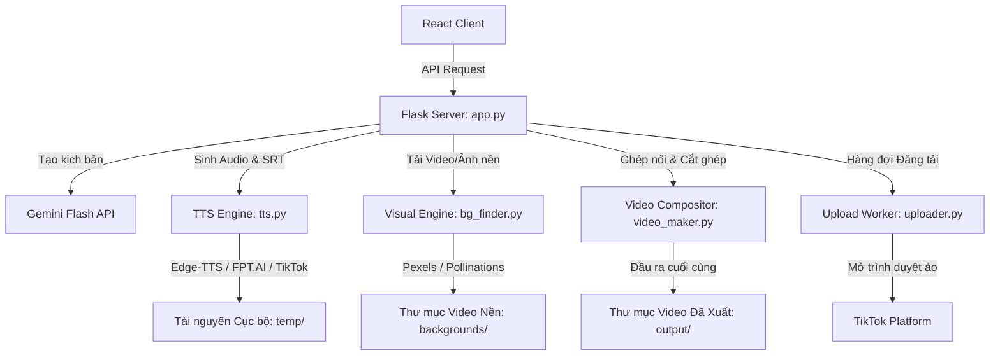

# Kiến trúc Hệ thống: VideoMaker Pro (make-video)

Tài liệu này mô tả cấu trúc kiến trúc cấp cao (High-level Architecture) của hệ thống VideoMaker Pro, phân tích các điểm nghẽn hiện tại và định hướng tối ưu hóa dài hạn.

---

## 1. Thiết kế Hệ thống Tổng quan (High-Level Design)

Hệ thống hoạt động theo mô hình **Modular Monolith** (Đơn khối dạng Mô-đun), kết hợp giữa dịch vụ giao diện (Flask Web App + Vite React) và các tác vụ nền dài hạn (Background Workers/Queue).

### Sơ đồ luồng dữ liệu (Data Flow)

---

## 2. Bounded Contexts (Các Phân vùng Nghiệp vụ)

Hệ thống được chia thành 6 phân vùng độc lập:

1. **Web Controller Layer (`app.py`)**: 
   - Quản lý API endpoints, phục vụ SPA React từ `frontend/dist`.
   - Lưu trữ trạng thái tạm thời của pipeline trong bộ nhớ (Memory State).
2. **Text-To-Speech (TTS) Engine (`tts.py`, `tiktok_tts.py`)**:
   - Nhận kịch bản thô -> Làm sạch -> Sinh tệp âm thanh `.mp3` và tệp phụ đề `.srt` / `_words.json`.
3. **Visual Engine (`bg_finder.py`, `bg_fetcher.py`, `ai_visuals.py`)**:
   - Phân tích ngữ nghĩa kịch bản bằng Gemini -> Rút trích từ khóa -> Tải video/hình ảnh.
   - Kiểm tra và lọc trùng lặp với lịch sử `used_backgrounds.json`.
4. **Video Compositor (`video_maker.py`)**:
   - Thực hiện chồng lớp hình ảnh, video, nhạc nền, phụ đề chuyển động (Ali Abdaal, MrBeast).
   - Xuất video dọc hoàn chỉnh chuẩn TikTok (1080x1920, 30fps).
5. **Auto Uploader & Nick Manager (`uploader.py`, `nick_manager.py`)**:
   - Quản lý profiles của các tài khoản đăng tải (cookie, proxy, tình trạng nick).
   - Tự động hóa đăng tải video bằng trình duyệt ẩn danh `DrissionPage`.
6. **Task Scheduler (`scheduler.py`)**:
   - Sử dụng `APScheduler` để đăng video vào "khung giờ vàng" định sẵn từ hàng đợi local.

---

## 3. Phân tích Điểm nghẽn & Đánh giá Thiết kế Hiện tại

Qua rà soát kiến trúc mã nguồn hiện tại, các vấn đề kiến trúc cần cải tiến bao gồm:

### 3.1. Trạng thái trong bộ nhớ (In-Memory State) và Khả năng đồng thì (Concurrency)
- **Vấn đề**: `app.py` lưu trạng thái pipeline qua biến toàn cục `pipeline_status`. Nếu người dùng click chạy hai tiến trình tạo video song song, trạng thái sẽ bị ghi đè chéo, gây lỗi hiển thị trên frontend.
- **Giải pháp**: Thiết kế cơ chế định danh công việc (Job ID) cho từng lần chạy pipeline. Trạng thái tiến trình sẽ được lưu trữ theo `job_id` trong một dictionary/cache hoặc database SQLite nhỏ, tránh xung đột.

### 3.2. Sự phụ thuộc cứng (Tight Coupling) và API Contracts quá dài
- **Vấn đề**: Các hàm cốt lõi như `make_video` nhận quá nhiều đối số riêng lẻ (13+ tham số). Khi có thêm tính năng mới, chữ ký hàm (function signature) phình to rất khó kiểm soát và dễ vỡ API.
- **Giải pháp**: Nhóm các tham số cấu hình video vào một thực thể hoặc Data Class (ví dụ `VideoConfig`, `TTSConfig`).

### 3.3. Xử lý lỗi sơ sài (Fortress Error Handling Degradation)
- **Vấn đề**: Rất nhiều khối `except: pass` hoặc bắt lỗi chung `except Exception as e:` làm nuốt mất dấu vết lỗi hệ thống (như lỗi MoviePy thiếu RAM, FFmpeg crash), gây khó khăn cho việc debug.
- **Giải pháp**: Áp dụng ghi log có cấu trúc (Structured Logging) với tracebacks chi tiết và bắt các ngoại lệ cụ thể (như `FileNotFoundError`, `requests.exceptions.RequestException`).

---

## 4. Định hướng Cải tiến Kiến trúc (ADR đã thiết lập)

1. **Tái thiết kế Kiến trúc Đồng thì & Hàng đợi (ADR-002)**:
   - Hệ thống chuyển đổi sang kiến trúc định danh Job (UUID) nhằm giải quyết dứt điểm xung đột đa nhiệm. Trạng thái Job được quản lý tập trung và lưu trữ bền vững thông qua SQLite (`jobs.db`).
   - Tích hợp `ThreadPoolExecutor` để giới hạn số luồng xử lý đồng thời, bảo vệ server khỏi quá tải RAM/CPU khi render.
2. **Cấu hình hóa & Decoupling (ADR-002)**:
   - Các tham số riêng lẻ của hàm `make_video` và các API endpoint được đóng gói thành các cấu trúc Class (`AudioConfig`, `SubtitleConfig`, `RenderConfig`, `VideoJobPayload`) giúp phân tách luồng điều khiển và luồng render.
3. **Cơ chế Caching thông minh cho Visual Assets**:
   - Tránh việc gọi API Pexels và tải lại các video cũ liên tục. Thêm cơ chế kiểm tra dung lượng và dọn dẹp thư mục tự động theo tuần thay vì xóa sạch mỗi lần chạy.
   - Quản lý và lưu trữ thông tin video đã sử dụng tại `used_backgrounds.json` để loại trừ khi tìm kiếm tài nguyên mới (ADR-001).
